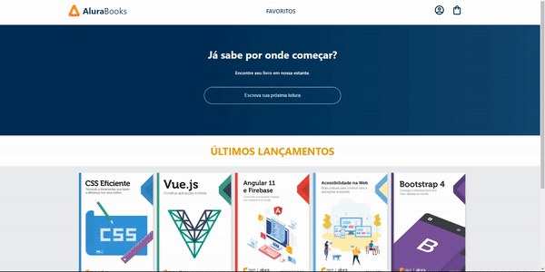

# AluraBooks React Project

Welcome to the AluraBooks React project repository! This project serves as a hands-on learning experience for practicing React concepts, including working with components, props, styled components, and managing state using `useState`. The project has been integrated with a Node.js server to dynamically fetch and manage book data through CRUD operations.

## Desktop Display

  

## Mobile Display

  

## Project Objectives

The primary goal of this repository is to provide a practical environment for learning and reinforcing React concepts. Key objectives include:

- **Component Development**: Practice creating and managing React components.
- **Props Usage**: Understand and implement the use of props to pass data between components.
- **Styled Components**: Explore the use of styled components for enhancing the project's visual aesthetics.
- **State Management**: Implement state management using the `useState` hook.
- **Responsivity**: The project's responsivity has been improved for a better user experience.
- **Node.js Integration**: Successfully integrated with a Node.js server to perform CRUD operations and manage book data dynamically.
- **React Router DOM**: Implemented a favorites route using React Router DOM for a more dynamic user experience.
- **useEffect and Axios**: Utilized `useEffect` to load books from the API when the page is loaded, and axios to connect to the Node.js server at `localhost:8000` to fetch and manage book data.

## Project Status

As of the last update, the project is done. The core features have been implemented, including Node.js integration, responsivity, and React Router DOM usage. 

## Technologies Used

- **React**: A JavaScript library for building user interfaces.
- **Styled Components**: A library for styling React components with tagged template literals.
- **Node.js**: A JavaScript runtime for server-side development, integrated for CRUD operations.
- **React Router DOM**: Declarative routing for React.js.
- **Axios**: A promise-based HTTP client for making requests to the Node.js server.

## Contributing

Contributions are welcome! If you have ideas for improvements, open an issue or create a pull request. For major changes, please discuss them in advance.
